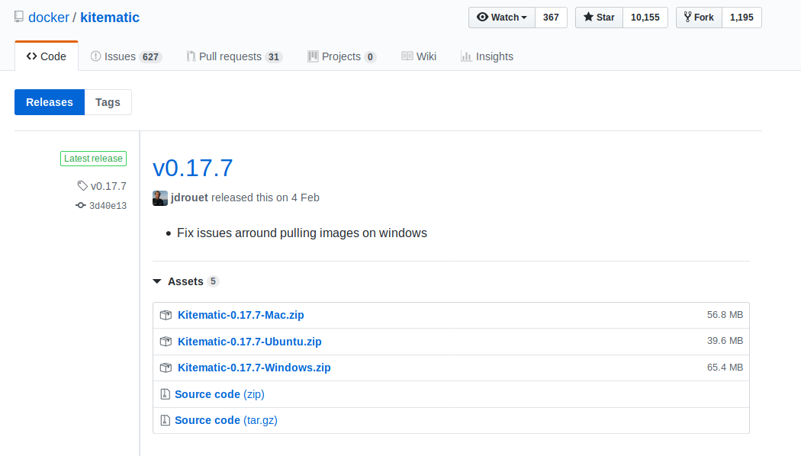

# Instalacion-Docker-y-Kitematic-Linux
Aqui una guía en español para instalar docker y su gui Kitematic para usuarios nuevos en linux mint/ ubuntu

## Instalación Docker

Dentro de una terminal ingresamos lo siguiente

### 1 Desinstalar versiones antiguas

``$ sudo apt-get remove docker docker-engine docker.io containerd runc``

### 2. Actualizar las lista de paquetes

``$ sudo apt-get update``

### 3. Instalar los paquetes necesarios para la instalacion de Docker

``sudo apt-get install apt-transport-https  ca-certificates curl gnupg-agent software-properties-common``

### 4. Copiamos las credenciales del repositorio de Docker

``curl -fsSL https://download.docker.com/linux/ubuntu/gpg | sudo apt-key add -``

### 5. Si eres usuario de **Ubuntu** simplemente ejecuta el comando:

``sudo add-apt-repository "deb [arch=amd64] https://download.docker.com/linux/ubuntu $(lsb_release -cs) stable"``

Para los usuario de **Linux Mint** ya que no existe una version exclusiva de Docker para Mint se debe realizar lo siguiente:

5.1. Conocer la distribucion 
``lsb_release -d``

5.2. Buscar a que version de ubuntu corresponde tu distribucion, puedes usar la siguiente tabla

5.3 Ejecutar el siguiente comando reemplazando la palabra RELEASE por la version de ubuntu que le corresponda a tu version de Mint:

``sudo add-apt-repository "deb [arch=amd64] https://download.docker.com/linux/ubuntu RELEASE stable"``

Por ejemplo si tu sistema operativo es Linux Mint Tara la version correspondiente en Ubuntu seria Ubuntu Bionic entonces ejecutarias
``sudo add-apt-repository "deb [arch=amd64] https://download.docker.com/linux/ubuntu bionic stable"``

6. Actualizar lista de paquetes

``sudo apt-get update``

7. Instalacion de Docker, cliente y contenedor

``sudo apt-get install docker-ce docker-ce-cli containerd.io``

8. Verificar la instalacion

``sudo docker run hello-world``

Si todo esta correcto se nos mostrara un mensaje similar a lo siguiente:

9. Dar permisos al grupo docker

``sudo groupadd docker``

10. Agregar tu usuario al grupo Docker 

``sudo usermod -aG docker $USER``

Por ejemplo si tu usuario es _carlos_ el comando seria: ``sudo usermod -aG docker carlos``

Si buscas un mayor nivel de configuracion puedes vistar el enlace [configuracion opcional](https://docs.docker.com/install/linux/linux-postinstall/)

**NOTA:**  [guía oficial de instalación en ingles](https://docs.docker.com/install/linux/docker-ce/ubuntu/) Aqui pueden encontrar los requerimientos de sistema e información necesario para otras distros de linux

##  Instalación Kitematic

1. Descargar el ultimo release del repositorio correspondiente a Ubuntu https://github.com/docker/kitematic/releases

2. En el directorio donde se encuentra la descarga descomprimir el archivo, se puede extraer haciendo clic derecho y extraer o con el comando

``tar -xvzf nombre_del_archivo_Kitematic``

por ejemplo: ``tar -xvzf Kitematic-0.17.7-Ubuntu.zip``

3. Ejecutar el paquete con el gestor de paquetes default(haciendo doble clic) o con el comando

``sudo dpkg -i nombre_del_archivo_descomprimido``

por ejemplo: ``sudo dpkg -i Kitematic-0.17.7_amd64.deb``

y Listo ya podemos ingresar a Kitematic a travez del icono o de la consola ``kitematic``

